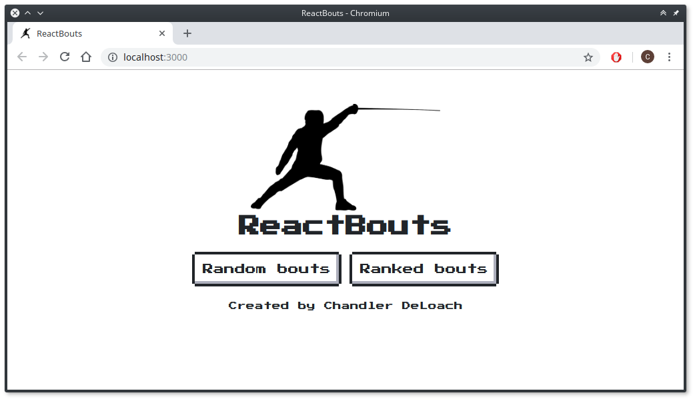

# ReactBouts

## What is ReactBouts?
ReactBouts is a simple tool for randomly generating matches for
1v1 competition sports. Its current release is tailored to
fencing, but adapting it to another sport wouldn't be rocket science
for someone who knows JavaScript and ReactJS.

## What can it do right now?
So far, the "random bouts" mode has been fully implemented. You can
enter a list of combatants and have it generate random bouts between
them, allowing you to time bouts and keep track of who wins each one.

The "ranked bouts" functionality is coming in a later release.
